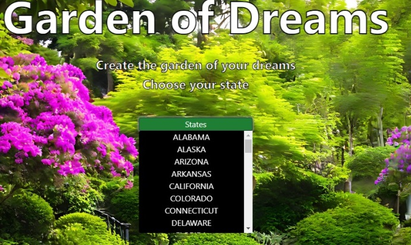
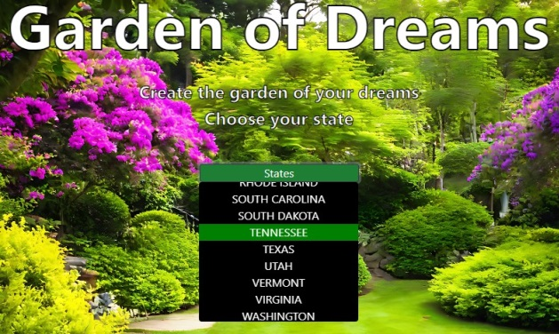
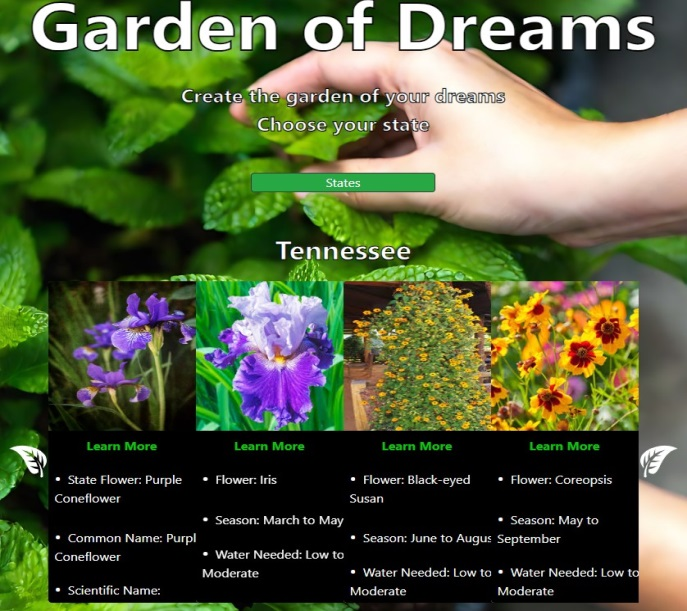
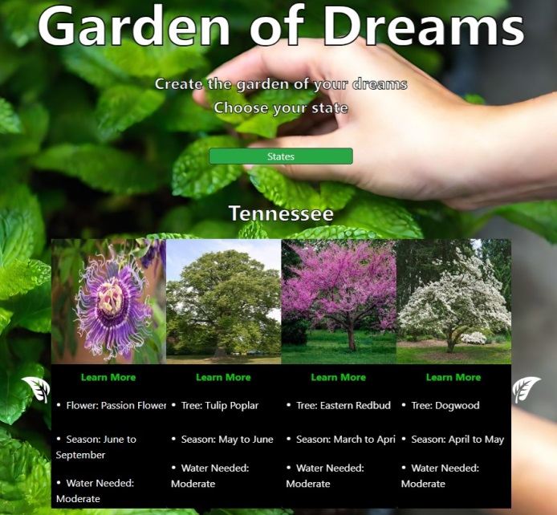

# Garden of Dreams

Welcome to Garden of Dreams, where you can explore the diverse flora of different states and cultivate the garden of your dreams! Whether you're a gardening enthusiast, nature lover, or simply curious about the botanical wonders of the United States, our website offers a wealth of information and inspiration to fuel your passion for plants.

## About

Garden of Dreams is a comprehensive online resource dedicated to showcasing the rich botanical heritage of each state in the U.S. From state flowers to native trees, crops to common weeds, our website provides detailed insights into the plant life that thrives across the nation. Whether you're interested in learning about gardening tips, identifying local flora, or simply appreciating the beauty of nature, Garden of Dreams has something for everyone.

## Features

- **State-Specific Information**: Explore the unique plant life of each state, including its state flower, tree, and notable crops.
- **Comprehensive Plant Profiles**: Dive deep into the characteristics, growing conditions, and cultural significance of various plants, from wildflowers to agricultural staples.
- **Educational Resources**: Learn about gardening techniques, plant care tips, and environmental conservation efforts to help you cultivate a thriving garden while preserving natural ecosystems.
- **Interactive Experience**: Engage with interactive features such as dropdown menus and carousel displays to navigate through the diverse collection of plant profiles effortlessly.
- **Beautiful Imagery**: Immerse yourself in stunning visuals of flowers, trees, and landscapes, curated to inspire and delight visitors of all ages.

## Getting Started

1. **Explore States**: Begin your journey by selecting a state from the dropdown menu to discover its unique plant diversity.

2. **Discover Plants**: Navigate through plant profiles to learn about state flowers, common weeds, native trees, and more.

3. **Learn and Grow**: Gain insights into gardening techniques, plant care practices, and environmental stewardship to enhance your gardening skills and contribute to the preservation of biodiversity.

4. **View More Info**: Click the leaf icon  to scroll through additional plant information.

## Contributing

Garden of Dreams is a collaborative platform that welcomes contributions from plant enthusiasts, botanists, and nature lovers alike. If you have insights, photos, or gardening expertise to share, feel free to reach out and join our community of plant enthusiasts dedicated to celebrating and safeguarding the natural world.

## Authors

- **Lee West** - [LeeWest89](https://github.com/LeeWest89)
- **Travis Adamason** - [TravisAdamson](https://github.com/TravisAdamson)
- **Matt Ernst** - [matternstsr](https://github.com/matternstsr)

## Connect With Us

Stay updated on the latest plant discoveries, gardening trends, and environmental news by following Garden of Dreams on social media. Join our growing community of plant lovers and share your passion for nature with like-minded individuals from around the world.

- Website: [www.gardenofdreams.com](www.gardenofdreams.com)
- Facebook: [GardenofDreams](https://www.facebook.com/GardenofDreams)
- Twitter: [@Garden_Dreams](https://twitter.com/Garden_Dreams)
- Instagram: [garden_of_dreams](https://www.instagram.com/garden_of_dreams/)

## Get Inspired. Grow Together. Explore Nature's Beauty with Garden of Dreams.
